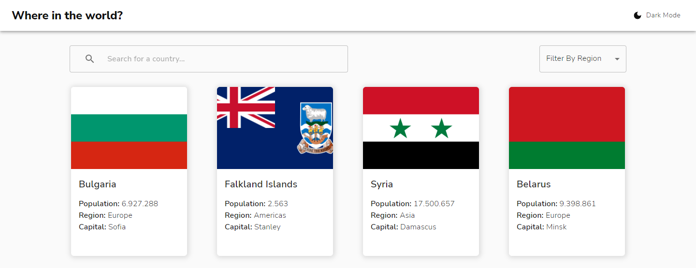
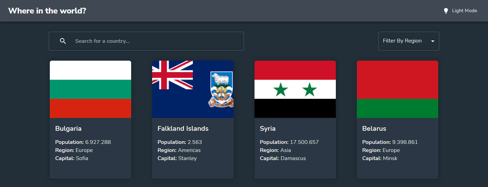

# Frontend Mentor - REST Countries API with color theme switcher solution

This is a solution to the [REST Countries API with color theme switcher challenge on Frontend Mentor](https://www.frontendmentor.io/challenges/rest-countries-api-with-color-theme-switcher-5cacc469fec04111f7b848ca). Frontend Mentor challenges help you improve your coding skills by building realistic projects. 

## Table of contents

- [Overview](#overview)
  - [The challenge](#the-challenge)
  - [Screenshot](#screenshot)
  - [Links](#links)
- [My process](#my-process)
  - [Built with](#built-with)
  - [What I learned](#what-i-learned)
  - [Useful resources](#useful-resources)
- [Author](#author)

## Overview

### The challenge

Users should be able to:

- See all countries from the API on the homepage
- Search for a country using an `input` field
- Filter countries by region
- Click on a country to see more detailed information on a separate page
- Click through to the border countries on the detail page
- Toggle the color scheme between light and dark mode *(optional)*

### Screenshot

### Links

- Solution URL: [RestCountries With Theme Switcher](https://restcountries-themeswitcher.netlify.app/)

## My process

### Built with

- [React](https://reactjs.org/) - JS library
- Typescript
- Styled Components
- Material UI for grid and components
- Mobile-first workflow
- [Styled Components](https://styled-components.com/) - For styles and theme switcher
- [React Fade-In](https://github.com/gkaemmer/react-fade-in#readme) ) Component for fade-in animations

### What I learned

I deepened my knowledge of material ui and styled components.

### Useful resources

- [Quicktype](https://app.quicktype.io/) - This helped me to define types of API responses.

## Author

- Frontend Mentor - [@thsrossi](https://www.frontendmentor.io/profile/thsrossi)
